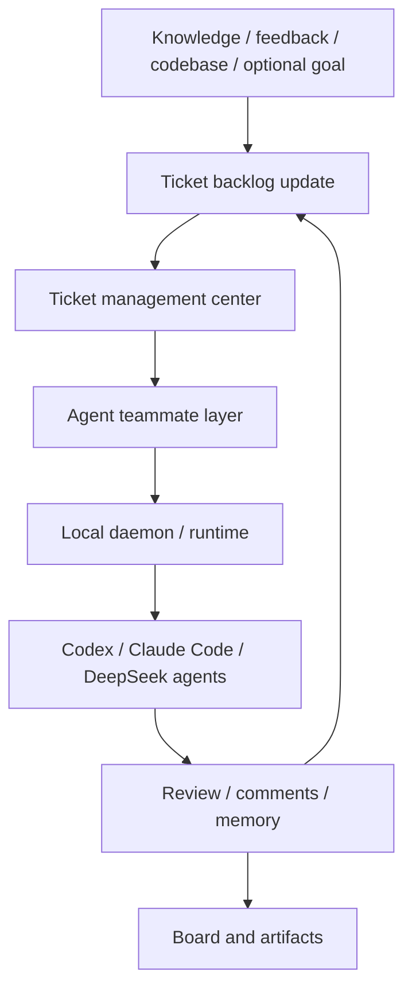

# Ariadne Ticket-Centered Architecture

This is the current architecture entrypoint for Ariadne v1.x.

## Position

Ariadne is a local-first Ticket-centered Agent Workbench for AI builders.

It turns external knowledge, execution feedback, review findings, memory, and
current codebase state into an evolving ticket backlog. Agents then work those
tickets through a Multica-style local work-management runtime.

Short form:

```text
Multica lets agents work issues.
Ariadne lets knowledge and feedback update tickets, then lets agents work tickets.
```

## Core Loop

```text
Knowledge / Feedback / Codebase
  -> update Ticket backlog
  -> Ticket management center
  -> assign to Agent
  -> local Daemon / Runtime
  -> DeepSeek / Codex / Claude Code
  -> Review / Comments / Board / Memory
  -> update Ticket backlog again
```

Goal is allowed as directional input. It is not the runtime center. The ticket
is the work unit, audit unit, board unit, and assignment unit.

## Layer Model



## Object Center

```text
BuildTicket
  -> BuildPacket
  -> TicketAssignment[]
  -> AgentRun[]
  -> AgentHandoff[]
  -> TicketComment[]
  -> RuntimeEvent[]
  -> Artifact[]
  -> ReviewReport
  -> MemoryRecord
  -> FeishuWritePlan
  -> NextTickets
```

`BuildTicket` corresponds to a Multica issue. It is visible, assignable,
reviewable, recoverable, and board-displayable.

`BuildPacket` is the structured context inside a ticket. It can be created from
sources, memory, review feedback, current codebase state, or a user goal.

`TicketAssignment` is the scheduling boundary. It records who should work the
ticket, which backend/planner is selected, and how the local daemon should claim
or retry the work.

`AgentRun` is one attempt by one agent role against a ticket or assignment. It
preserves lifecycle state, typed failure reason, artifacts, backend choice, and
execution summary.

`TicketComment` is the visible collaboration surface. Progress, blockers,
review summaries, memory updates, and recovery notes should be visible here.

## Multica Alignment

Ariadne absorbs Multica's work-management architecture:

- issue/ticket as the work carrier;
- agents as assignable teammates;
- task/assignment lifecycle;
- daemon/runtime claiming work;
- progress and blocker comments;
- explicit runtime capability;
- reusable skills;
- typed project resources;
- board as the visible operational surface.

Ariadne does not copy Multica's hosted product shape:

- no Go server requirement;
- no Postgres requirement;
- no multi-tenant workspace requirement;
- no auth or permission platform;
- no WebSocket collaboration layer;
- no hosted frontend requirement.

The implementation remains Python, local-first, single-user, JSON/JSONL-backed,
Workbench-first, and safety-gated for real external execution. CLI commands are
operator/debug surfaces, not product acceptance.

## Current Product Path

```text
Browser Workbench
  -> Project / Target Version / Goal
  -> External Sources + Target Codebase
  -> Source Artifacts / ProjectKnowledge
  -> Issue Delta
  -> Current Version Issue Set
  -> Assign to Agent
  -> Runtime Claim
  -> Real Codex / Claude Attempt
  -> Diff / Tests / Review / Inbox / Memory / Next Issues
  -> Current Version Progress
```

`ticket run`, `daemon run-once`, `export board`, and doctor commands remain
local operator tools. They do not prove product closure by themselves. The
product closure standard is browser-driven Project Version Delivery:

```bash
ari ticket assign <current-ticket> --to codex --runtime-profile production
ARIADNE_ENABLE_EXTERNAL_EXECUTION=1 scripts/verify_dogfood_browser.sh --real
```

The gated backend attempt inside that browser path must still resolve to a real
production agent assignment. The operator-equivalent command shape is:

```bash
ari ticket assign <current-ticket> --to codex --runtime-profile production
ARIADNE_ENABLE_EXTERNAL_EXECUTION=1 ari daemon run-once --confirm-execution
```

Those commands are diagnostic equivalents for the selected current-version
ticket; they are not product closure unless driven and evidenced through the
browser flow above.

The accepted success status is `REAL_CLOSED`. If the local external execution
environment blocks the run, the accepted honest status is `BLOCKED_WITH_EVIDENCE`
with a concrete external blocker. Missing implementation, fake data, empty
handoff, absent source analysis, or missing evidence are product failures, not
acceptable external blockers.

## Offline Regression Fixture

The deterministic no-credential fixture remains:

```bash
ari ticket assign ARI-003 --to fake-codex
ari daemon run-once
ari demo full
```

This path is for automated tests, local fixture validation, and debugging. It
does not satisfy production acceptance and must not be presented as the product
path.

## Development Rule

When a new source, blog, paper, review, or codebase observation arrives, do not
rewrite the whole product goal by default. Update the ticket set:

- add tickets for newly discovered useful work;
- raise or lower priorities;
- split tickets that are too broad;
- downgrade tickets whose rationale weakened;
- close or supersede tickets made obsolete by new evidence;
- record why the backlog changed.

This keeps Ariadne's state machine explicit and reviewable.
