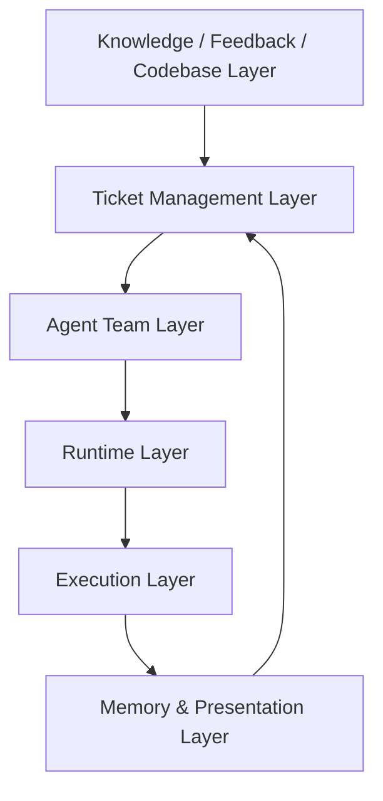
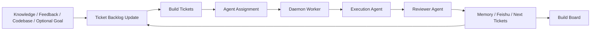
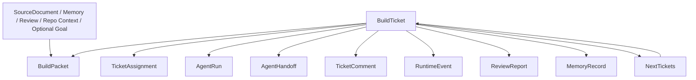
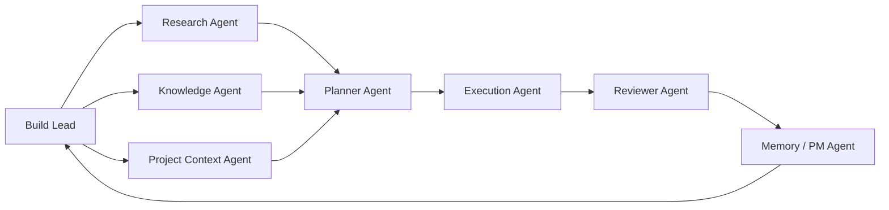
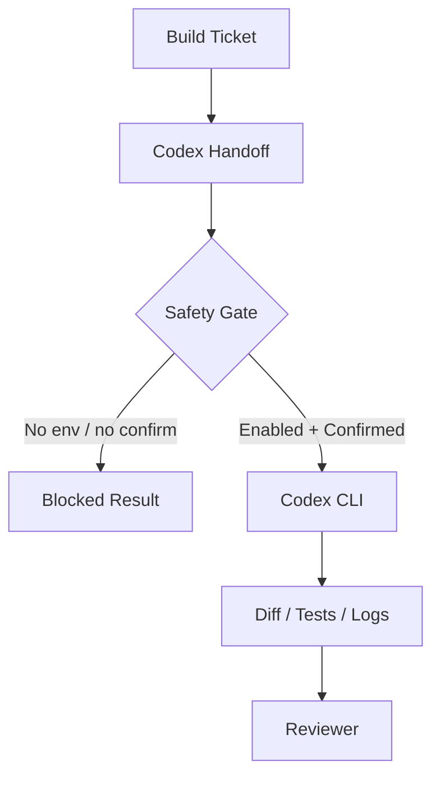

# Ariadne v1.0 Architecture

Status: Updated by
[`ADR-0004`](../adr/ADR-0004-ticket-centered-agent-workbench.md).

Ariadne v1.0 is frozen around one product definition:

```text
Ariadne = local-first Ticket-centered Agent Workbench
```

Chinese expression:

```text
Ariadne 是一个本地优先、以 Ticket 为中心的 Agent 工作台。
它让外部知识、执行反馈、Review、Memory 和当前代码状态持续更新 Ticket 列表，
再把 Ticket 分配给 Agent，通过本地 runtime 执行、审查、沉淀和继续迭代。
```

## One-Sentence Positioning

Ariadne is a local-first Ticket-centered Agent Workbench for AI builders. It
turns knowledge and feedback into an evolving Build Ticket backlog, then lets
agents execute those tickets through a Multica-style local runtime.

## Product Core

Ariadne is not:

- a generic RAG system;
- a knowledge base;
- a meeting summarizer;
- a Codex replacement;
- a Multica clone;
- a BuildGoal-first planner.

Ariadne is:

```text
Ticket-centered Agent Workbench
```

Its core loop is:

```text
Knowledge / Feedback / Codebase
  -> update Ticket backlog
  -> Ticket management center
  -> assign to Agent
  -> local Daemon / Runtime
  -> DeepSeek / Codex / Claude Code
  -> Review / Comments / Board / Memory
  -> update Ticket backlog again
```

Learning-to-Build is the business scenario. The product value is the local
agent workbench that keeps work visible, assignable, reviewable, and
remembered. Ariadne's difference from Multica is not that it replaces issues
with goals. The difference is that knowledge and feedback can continuously
change the ticket set before and after agents execute work.

## Six-Layer Architecture



### 1. Knowledge / Feedback / Codebase Layer

Responsibilities:

- receive external sources;
- receive optional user goals as directional input;
- read historical knowledge and memory;
- read current repository context;
- read review and execution feedback;
- decide whether the ticket backlog should be added to, reprioritized,
  downgraded, split, closed, or superseded.

Core objects:

- `SourceDocument`
- `KnowledgeSource`
- `RepoContext`
- `MemoryContext`
- `ReviewFeedback`
- optional goal metadata

This is Ariadne's upstream difference from Multica. Multica starts from an
existing issue. Ariadne can let external knowledge and feedback reshape the
ticket backlog.

### 2. Ticket Management Layer

Responsibilities:

- carry work;
- assign work;
- record state;
- record comments;
- record handoffs;
- record runtime events;
- preserve reviewable artifacts;
- support recovery decisions.

Core objects:

- `BuildTicket`
- `BuildPacket`
- `TicketAssignment`
- `AgentRun`
- `AgentHandoff`
- `TicketComment`
- `RuntimeEvent`
- `ReviewReport`
- `MemoryRecord`

Most important objects:

- `BuildTicket`: the visible work carrier, similar to a Multica issue.
- `BuildPacket`: the structured translation from source, memory, review,
  codebase context, or a goal into executable work.
- `TicketAssignment`: the act of assigning a ticket to an agent teammate.

### 3. Agent Team Layer

Fixed v1.0 agent roles:

- Build Lead Agent
- Research Agent
- Knowledge Agent
- Project Context Agent
- Planner Agent
- Execution Agent
- Reviewer Agent
- Memory / PM Agent

Role responsibilities:

- Build Lead: routes ticket work and decides who should handle each stage.
- Research: reads papers, blogs, and GitHub projects.
- Knowledge: retrieves historical memory, prior tickets, and decision records.
- Project Context: understands the current repository, modules, tests, and
  constraints.
- Planner: creates Build Packets, tasks, acceptance criteria, and handoff
  prompts.
- Execution: calls production Codex or Claude Code backends when gates are
  satisfied; tests and offline fixtures may use `fake-codex`.
- Reviewer: checks diff, tests, scope, and acceptance criteria.
- Memory / PM: writes memory, Feishu preview plans, and next tickets; real
  Feishu writes go through the gated Feishu command.

Ariadne's multi-agent design is not role-play. Agents collaborate through
Tickets, Assignments, Handoffs, Runs, Reviews, Comments, and Artifacts.

### 4. Runtime Layer

Responsibilities:

- how agents claim work;
- how assignments run;
- how failures are classified;
- whether work can be retried;
- whether progress is visible.

Core objects and capabilities:

- `DaemonWorker`
- `RuntimeCapability`
- `WorkerHeartbeat`
- `RuntimeJournal`
- `DirectoryLock`
- `RetryQueue`
- `ResumePlan`
- assignment queue;
- `daemon run-once` and `daemon start`;
- runtime heartbeat;
- journal events;
- local lock;
- retry;
- recover;
- backend doctor.

This layer is where Ariadne demonstrates serious agent-runtime engineering
rather than a prompt-chain demo.

### 5. Execution Layer

Responsibilities:

- execute code changes;
- receive handoff prompts;
- restrict execution scope;
- capture stdout and stderr;
- capture exit code;
- capture changed files and git diff;
- run tests;
- return `ExecutionResult`.

Backends:

- `codex`: real Codex production backend, safety-gated.
- `claude-code`: real Claude Code production backend, safety-gated.
- `shell`: low-level command backend, requires confirmation.
- `fake-codex`: deterministic test and offline fixture backend only.
- `dry-run`: preview, no-credential, or safety fallback only.

Real external execution requires both:

```text
ARIADNE_ENABLE_EXTERNAL_EXECUTION=1
--confirm-execution
```

### 6. Memory & Presentation Layer

Responsibilities:

- preserve execution results;
- generate next iteration entry points;
- display the full loop;
- support reviews, release evidence, and offline fixture validation;
- feed review and memory back into the ticket backlog.

Core objects:

- `MemoryRecord`
- `FeishuWritePlan`
- `NextTickets`
- `BuildBoard`
- `EvaluationReport`
- `ReleaseEvidencePacket`

Capabilities:

- memory write-back;
- decision log;
- Feishu preview plan;
- gated real Feishu write evidence;
- next tickets;
- board;
- comments timeline;
- journal timeline;
- review report;
- release evidence packet.

## Main Chain



## Object Relationship



## Agent Team



## Codex Safety Gate



## v1.0 Boundaries

Ariadne v1.0 does not do:

- full Multica clone;
- Go server;
- Postgres;
- multi-tenant workspace;
- complex permission system;
- WebSocket real-time collaboration;
- production daemon fleet;
- automatic commit, push, merge, or PR;
- ungated real Feishu writes;
- ungated real Codex or Claude Code execution;
- long-running unattended operation;
- BuildGoal-first scheduler.

Ariadne v1.0 does:

- local-first operation;
- single-user workflow;
- ticket-centered work management;
- knowledge and feedback driven backlog updates;
- production Codex and Claude Code execution when configured and confirmed;
- review, memory, and next tickets;
- static or local board presentation.
