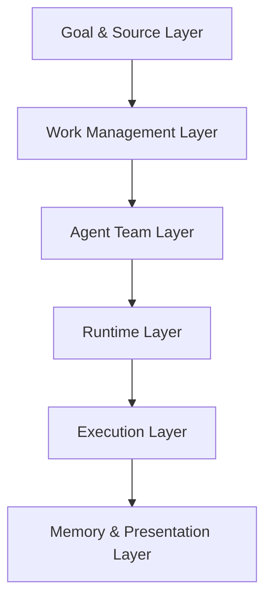
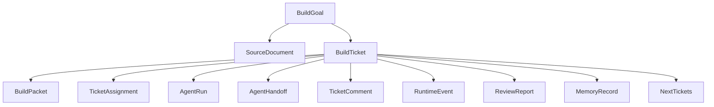
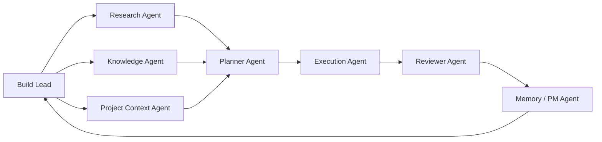
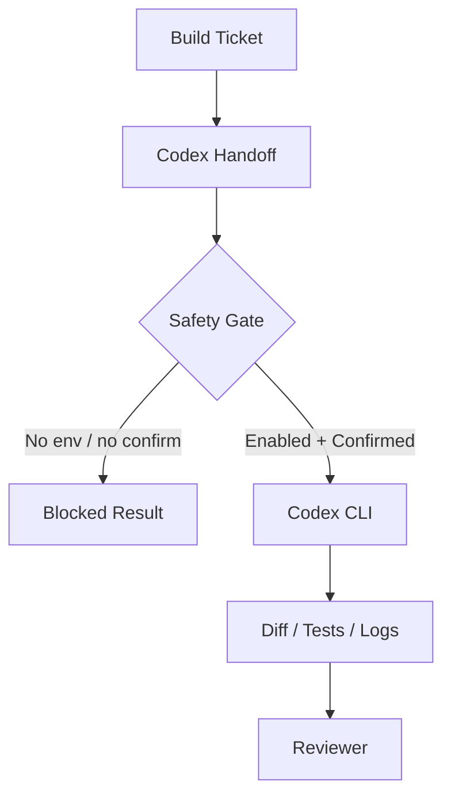

# Ariadne v1.0 Architecture

Ariadne v1.0 is frozen around one product definition:

```text
Ariadne = Goal-driven Multi-Agent Build Team
```

Chinese expression:

```text
Ariadne 是一个目标驱动的多 Agent 构建团队。
它从一个 Build Goal 出发，结合外部知识、历史记忆和当前代码上下文，
生成 Build Tickets，并组织多个 Agent 协作完成软件迭代。
```

## One-Sentence Positioning

Ariadne is a Goal-driven Multi-Agent Build Team for AI builders. It converts a
build goal, external knowledge, and project context into executable,
reviewable, and memorable software iterations.

## Product Core

Ariadne is not:

- a generic RAG system;
- a knowledge base;
- a meeting summarizer;
- a Codex replacement;
- a Multica clone.

Ariadne is:

```text
Goal-driven Multi-Agent Build Team
```

Its core loop is:

```text
Goal -> Tickets -> Assignments -> Agent Runs -> Review -> Memory -> Next Tickets
```

Learning-to-Build is the business scenario. Multi-Agent Build Team is the
product value. Goal-driven orchestration is the architectural difference between
Ariadne and Multica.

## Six-Layer Architecture



### 1. Goal & Source Layer

Responsibilities:

- receive Build Goals;
- receive external sources;
- read historical knowledge and memory;
- read current repository context;
- decide which information is worth turning into project work.

Core objects:

- `BuildGoal`
- `SourceDocument`
- `KnowledgeSource`
- `RepoContext`
- `MemoryContext`

This is Ariadne's upstream difference from Multica. Multica starts from an
existing issue. Ariadne starts from a build goal plus knowledge.

### 2. Work Management Layer

Responsibilities:

- carry work;
- assign work;
- record state;
- record comments;
- record handoffs;
- record runtime events;
- support recovery decisions.

Core objects:

- `BuildTicket`
- `BuildPacket`
- `TicketAssignment`
- `AgentRun`
- `AgentHandoff`
- `TicketComment`
- `RuntimeEvent`
- `ReviewReport`
- `MemoryRecord`

Most important objects:

- `BuildTicket`: the visible work carrier, similar to a Multica issue.
- `BuildPacket`: the structured translation from goal or knowledge to an
  executable task.
- `TicketAssignment`: the act of assigning a ticket to an agent teammate.

### 3. Agent Team Layer

Fixed v1.0 agent roles:

- Build Lead Agent
- Research Agent
- Knowledge Agent
- Project Context Agent
- Planner Agent
- Execution Agent
- Reviewer Agent
- Memory / PM Agent

Role responsibilities:

- Build Lead: understands the goal, routes work, and decides who should handle
  each stage.
- Research: reads papers, blogs, and GitHub projects.
- Knowledge: retrieves historical memory, prior tickets, and decision records.
- Project Context: understands the current repository, modules, tests, and
  constraints.
- Planner: creates Build Packets, tasks, acceptance criteria, and handoff
  prompts.
- Execution: calls Codex, Claude, fake-codex, shell, or dry-run backends.
- Reviewer: checks diff, tests, scope, and acceptance criteria.
- Memory / PM: writes memory, Feishu dry-run plans, and next tickets.

Ariadne's multi-agent design is not role-play. Agents collaborate through
Tickets, Assignments, Handoffs, Runs, Reviews, Comments, and Artifacts.

### 4. Runtime Layer

Responsibilities:

- how agents claim work;
- how assignments run;
- how failures are classified;
- whether work can be retried;
- whether progress is visible.

Core objects and capabilities:

- `DaemonWorker`
- `RuntimeCapability`
- `WorkerHeartbeat`
- `RuntimeJournal`
- `DirectoryLock`
- `RetryQueue`
- `ResumePlan`
- assignment queue;
- `daemon run-once` and `daemon start`;
- runtime heartbeat;
- journal events;
- local lock;
- retry;
- recover;
- backend doctor.

This layer is where Ariadne demonstrates serious agent-runtime engineering
rather than a prompt-chain demo.

### 5. Execution Layer

Responsibilities:

- execute code changes;
- receive handoff prompts;
- restrict execution scope;
- capture stdout and stderr;
- capture exit code;
- capture changed files and git diff;
- run tests;
- return `ExecutionResult`.

Backends:

- `fake-codex`: stable deterministic local demo backend.
- `codex`: real Codex backend, safety-gated.
- `claude-code`: Claude Code backend scaffold, safety-gated.
- `shell`: low-level command backend, requires confirmation.
- `dry-run`: records without executing.

Real external execution requires both:

```text
ARIADNE_ENABLE_EXTERNAL_EXECUTION=1
--confirm-execution
```

### 6. Memory & Presentation Layer

Responsibilities:

- preserve execution results;
- generate next iteration entry points;
- display the full loop;
- support demos, reviews, and interview explanation.

Core objects:

- `MemoryRecord`
- `FeishuWritePlan`
- `NextTickets`
- `BuildBoard`
- `EvaluationReport`
- `DemoScript`

Capabilities:

- memory write-back;
- decision log;
- Feishu dry-run plan;
- next tickets;
- board;
- comments timeline;
- journal timeline;
- review report;
- demo report.

## Main Chain

```mermaid
flowchart LR
  Goal["Build Goal"] --> Source["Sources / Knowledge / Repo Context"]
  Source --> Plan["Multi-Agent Planning"]
  Plan --> Ticket["Build Tickets"]
  Ticket --> Assignment["Agent Assignment"]
  Assignment --> Daemon["Daemon Worker"]
  Daemon --> Exec["Execution Agent"]
  Exec --> Review["Reviewer Agent"]
  Review --> Memory["Memory / Feishu / Next Tickets"]
  Memory --> Board["Build Board"]
```



## Object Relationship



## Agent Team



## Codex Safety Gate



## v1.0 Boundaries

Ariadne v1.0 does not do:

- full Multica clone;
- Go server;
- Postgres;
- multi-tenant workspace;
- complex permission system;
- WebSocket real-time collaboration;
- production daemon fleet;
- automatic commit, push, merge, or PR;
- default real Feishu writes;
- default real Codex execution;
- long-running unattended operation.

Ariadne v1.0 does:

- local-first operation;
- single-user workflow;
- goal-driven multi-agent architecture;
- ticket-driven work management;
- optional Codex and Claude execution;
- review, memory, and next tickets;
- static or local board presentation.
