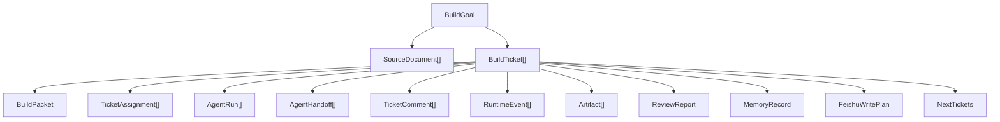

# Ariadne v1.0 Object Model

This document freezes the object relationships Ariadne v1.0 should preserve
while it evolves from a ticket-driven local MVP toward a Goal-driven
Multi-Agent Build Team.

## Relationship Summary

```text
BuildGoal
  └── SourceDocument[]
  └── BuildTicket[]

BuildTicket
  └── BuildPacket
  └── TicketAssignment[]
  └── AgentRun[]
  └── AgentHandoff[]
  └── TicketComment[]
  └── RuntimeEvent[]
  └── Artifact[]
  └── ReviewReport
  └── MemoryRecord
  └── FeishuWritePlan
  └── NextTickets
```



## BuildGoal

`BuildGoal` is what the user actually wants to accomplish.

Examples:

- make Ariadne more like a Multica-aligned agent team;
- turn real Codex execution into the main demo path;
- improve source intelligence and memory retrieval.

BuildGoal is the architectural object that makes Ariadne goal-driven rather
than issue-driven. If the current implementation uses source ingestion as a
bridge, BuildGoal remains the frozen v1.0 direction.

## SourceDocument

`SourceDocument` is an external or project-local knowledge input.

Sources can include papers, blogs, GitHub notes, project reviews, office-hour
notes, or self-improvement notes. They provide evidence and context for future
Build Tickets.

## BuildTicket

`BuildTicket` is the executable work unit.

It corresponds to a Multica issue. It is visible, assignable, reviewable, and
board-displayable. A ticket carries enough identity and state for humans and
agents to coordinate work.

## BuildPacket

`BuildPacket` is the structured translation from goal or knowledge to work.

It should contain source summary, insight, evidence, project relevance, build
decision, tasks, acceptance criteria, affected modules, risks, and assumptions.
It is the bridge between "we learned something" and "a coding agent can act."

## TicketAssignment

`TicketAssignment` records that a ticket was assigned to an agent or team.

It separates the work carrier from the work attempt. The same ticket can have
multiple assignments across retry, handoff, or rerun scenarios.

## AgentRun

`AgentRun` is one execution by one agent against one ticket or assignment.

It should preserve lifecycle state, failure reason, artifacts, backend choice,
and execution summary. It is the audit trail for what an agent actually did.

## AgentHandoff

`AgentHandoff` records agent-to-agent transfer.

Current v1 behavior may use handoffs as visible records. The frozen direction is
to let handoffs become scheduling boundaries:

```text
Build Lead -> Planner -> Execution -> Reviewer -> Memory
```

## TicketComment

`TicketComment` is the collaboration surface for humans and agents.

It records progress, blockers, review summaries, memory updates, handoff notes,
and recovery hints. Comments make agent work visible without needing a
production web platform.

## RuntimeEvent

`RuntimeEvent` is the system journal entry.

It records assignment creation, claim, execution, review, memory, board export,
failure, and recovery-relevant events. It is lower-level than a comment and is
used for diagnostics and recovery.

## Artifact

`Artifact` is any durable output worth reviewing.

Examples include handoff prompts, planner reports, execution results, review
reports, Feishu dry-run plans, board exports, route decisions, and next-ticket
artifacts.

## ReviewReport

`ReviewReport` is the conservative result check.

It explains whether the execution passed, failed, or needs human review. It
should reference test results, changed files, failed checks, warnings, and
required fixes.

## MemoryRecord

`MemoryRecord` is long-term project context.

It preserves what was built, why, what passed or failed, what decisions were
made, and what should be remembered for future planning.

## FeishuWritePlan

`FeishuWritePlan` is a dry-run write plan for external collaboration systems.

It must remain dry-run unless `FEISHU_ENABLE_WRITE=1` and `--confirm-write` are
both present.

## NextTickets

`NextTickets` is the next iteration entry point.

It converts review results, memory gaps, failed checks, warnings, and changed
files into candidate future Build Tickets.

## Design Rule

The core object boundary is:

```text
Goal decides why.
Ticket decides what.
Packet translates context into executable work.
Assignment decides who.
Run records one attempt.
Handoff connects agents.
Comment exposes collaboration.
Journal records runtime facts.
Artifact preserves reviewable output.
Memory preserves long-term context.
Next Tickets start the next loop.
```
