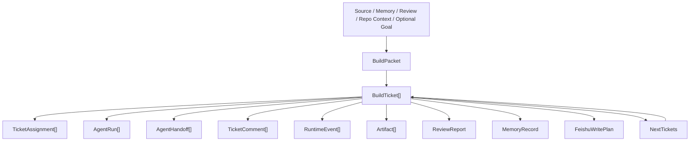

# Ariadne v1.0 Object Model

Status: Updated by
[`ADR-0004`](../adr/ADR-0004-ticket-centered-agent-workbench.md).

This document freezes the object relationships Ariadne v1.0 should preserve as
a local-first Ticket-centered Agent Workbench.

## Relationship Summary

```text
Knowledge / Feedback / Codebase / Optional Goal
  └── SourceDocument[]
  └── MemoryRecord[]
  └── ReviewReport[]
  └── BuildPacket[]
  └── BuildTicket[]

BuildTicket
  └── BuildPacket
  └── TicketAssignment[]
  └── AgentRun[]
  └── AgentHandoff[]
  └── TicketComment[]
  └── RuntimeEvent[]
  └── Artifact[]
  └── ReviewReport
  └── MemoryRecord
  └── FeishuWritePlan
  └── NextTickets
```



## AgentDefinition

`AgentDefinition` is the user-visible teammate object.

It is persisted as local JSON under:

```text
.ariadne/agents/<agent_id>.json
```

It carries the fields a user expects from a Multica-style agent surface:

- name and description;
- avatar seed;
- status (`active`, `paused`, `archived`);
- persistent instructions;
- skill bindings;
- visibility metadata;
- runtime profile.

`AgentRuntimeProfile` stores the local execution target for the agent, including
backend (`codex` or `claude-code`), optional model, working directory, and
environment key names. It stores key names only, not secret values.

`AgentVisibility` stores local visibility/team metadata. Ariadne remains
single-user and local-first; this is product semantics, not multi-tenant auth.

`AgentProfile` is retained only as an internal compatibility shape for older
assignment and test code. Workbench product pages must project real
`AgentDefinition` records and must not auto-materialize fake `profiles.json`
rows.

## Optional Goal Metadata

A goal is directional input. It can explain why a set of tickets exists, but it
is not the root object of the runtime.

Examples:

- make Ariadne more like a Multica-aligned agent team;
- turn real Codex and Claude Code execution into production execution paths;
- improve source intelligence and memory retrieval.

The implementation should not introduce a second BuildGoal-first state machine
parallel to tickets and assignments. If goal metadata is added later, it should
attach to tickets, sources, planning artifacts, or backlog update records.

## SourceDocument

`SourceDocument` is an external or project-local knowledge input.

Sources can include papers, blogs, GitHub notes, project reviews, office-hour
notes, or self-improvement notes. They provide evidence and context for future
Build Tickets.

## BuildTicket

`BuildTicket` is the executable work unit.

It corresponds to a Multica issue. It is visible, assignable, reviewable, and
board-displayable. A ticket carries enough identity and state for humans and
agents to coordinate work.

## BuildPacket

`BuildPacket` is the structured translation from knowledge, feedback, current
repo context, review output, or optional goal input into work.

It should contain source summary, insight, evidence, project relevance, build
decision, tasks, acceptance criteria, affected modules, risks, and assumptions.
It is the bridge between "we learned something" and "a coding agent can act."

## TicketAssignment

`TicketAssignment` records that a ticket was assigned to an agent or team.

It separates the work carrier from the work attempt. The same ticket can have
multiple assignments across retry, handoff, or rerun scenarios.

## AgentRun

`AgentRun` is one execution by one agent against one ticket or assignment.

It should preserve lifecycle state, failure reason, artifacts, backend choice,
and execution summary. It is the audit trail for what an agent actually did.

## AgentHandoff

`AgentHandoff` records agent-to-agent transfer.

Current v1 behavior may use handoffs as visible records. The frozen direction is
to let handoffs become scheduling boundaries:

```text
Build Lead -> Planner -> Execution -> Reviewer -> Memory
```

## TicketComment

`TicketComment` is the collaboration surface for humans and agents.

It records progress, blockers, review summaries, memory updates, handoff notes,
and recovery hints. Comments make agent work visible without needing a
production web platform.

## RuntimeEvent

`RuntimeEvent` is the system journal entry.

It records assignment creation, claim, execution, review, memory, board export,
failure, and recovery-relevant events. It is lower-level than a comment and is
used for diagnostics and recovery.

## Artifact

`Artifact` is any durable output worth reviewing.

Examples include handoff prompts, planner reports, execution results, review
reports, Feishu preview plans, gated Feishu write results, board exports, route
decisions, and next-ticket artifacts.

## ReviewReport

`ReviewReport` is the conservative result check.

It explains whether the execution passed, failed, or needs human review. It
should reference test results, changed files, failed checks, warnings, and
required fixes.

## MemoryRecord

`MemoryRecord` is long-term project context.

It preserves what was built, why, what passed or failed, what decisions were
made, and what should be remembered for future planning.

## FeishuWritePlan

`FeishuWritePlan` is a preview write plan for external collaboration systems.

It must remain preview-only unless `FEISHU_ENABLE_WRITE=1` and
`--confirm-write` are both present. A confirmed real write is recorded as
integration evidence, not inferred from the preview plan.

## NextTickets

`NextTickets` is the next iteration entry point.

It converts review results, memory gaps, failed checks, warnings, changed files,
new sources, and codebase observations into candidate future Build Tickets.

## Design Rule

The core object boundary is:

```text
Goal explains why when present.
Ticket decides what.
Packet translates context into executable work.
Assignment decides who.
Run records one attempt.
Handoff connects agents.
Comment exposes collaboration.
Journal records runtime facts.
Artifact preserves reviewable output.
Memory preserves long-term context.
Next Tickets update the backlog.
```
