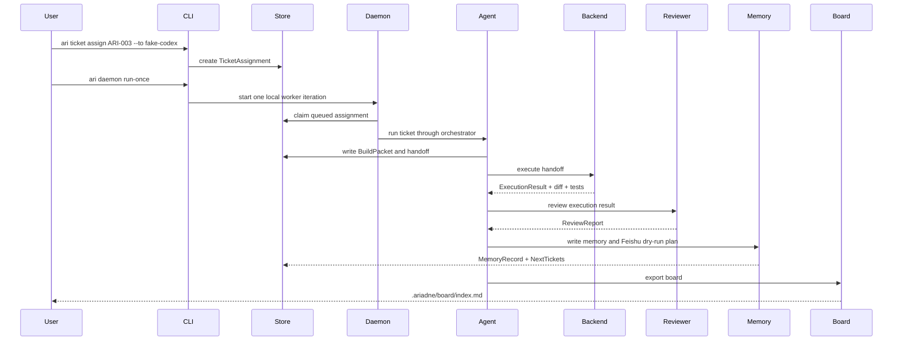
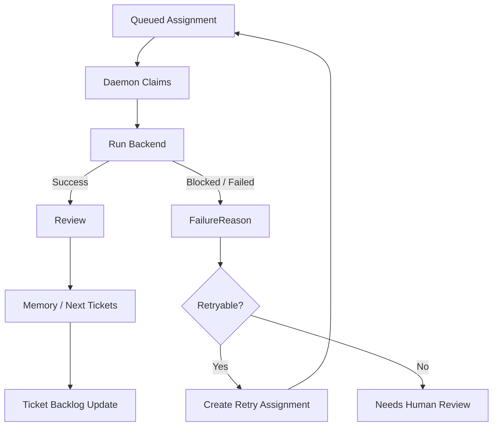

# Ariadne v1.0 Runtime Flow

Status: Updated by
[`ADR-0004`](../adr/ADR-0004-ticket-centered-agent-workbench.md).

This document freezes the Ariadne v1.0 runtime paths around ticket-centered
agent work. Historical BuildGoal-first command sketches are superseded; a goal
may be an input, but the runtime works tickets and assignments.

## Current v1.0 Product Path

The stable local path is Agent Teammate Mode:

```bash
ari ingest examples/sources/*.md
ari ticket list
ari ticket assign ARI-003 --to fake-codex
ari daemon run-once
ari ticket comments ARI-003
ari runtime journal
ari export board
```

Fallback:

```bash
python3.11 -m ariadne_ltb.cli ingest examples/sources/*.md
python3.11 -m ariadne_ltb.cli ticket list
python3.11 -m ariadne_ltb.cli ticket assign ARI-003 --to fake-codex
python3.11 -m ariadne_ltb.cli daemon run-once
python3.11 -m ariadne_ltb.cli ticket comments ARI-003
python3.11 -m ariadne_ltb.cli runtime journal
python3.11 -m ariadne_ltb.cli export board
```

This path proves:

```text
Source / Knowledge / Feedback
  -> Build Ticket
  -> Build Packet
  -> Assignment
  -> Daemon Worker
  -> Planner / Handoff
  -> Backend Execution
  -> Reviewer
  -> Memory / Feishu Dry Run / Next Tickets
  -> Board
  -> Backlog update
```

## Backlog Update Rule

When new external knowledge or execution feedback arrives, Ariadne should update
the ticket set instead of rewriting a global goal object:

- add new tickets;
- change priority;
- split or merge work;
- mark work blocked;
- supersede obsolete tickets;
- create next-ticket artifacts with rationale.

## Direct Full-Loop Path

`ticket run` remains available for direct orchestration:

```bash
ari ticket run ARI-003 --backend fake-codex
```

It performs the complete loop without requiring a separate daemon assignment
step. Agent Teammate Mode is preferred for product demonstrations because it
makes assignment, claim, comments, and runtime state visible.

## Real Codex Path

The real Codex path is optional and safety-gated:

```bash
ari ticket assign ARI-003 --to codex
ARIADNE_ENABLE_EXTERNAL_EXECUTION=1 ari daemon run-once --confirm-execution
```

Required boundaries:

- real Codex execution is off by default;
- both `ARIADNE_ENABLE_EXTERNAL_EXECUTION=1` and `--confirm-execution` are
  required;
- Codex unavailable or gate missing must produce a blocked result;
- Ariadne must not silently fall back to fake-codex;
- Ariadne must not auto-commit, auto-push, auto-merge, or create PRs.

## Runtime Sequence



## Failure And Recovery Flow



## Visibility Surfaces

Runtime work must be visible through:

- `ari ticket comments <ticket>`;
- `ari runtime journal`;
- `ari runtime recover`;
- `ari daemon status`;
- `.ariadne/artifacts/<ticket_id>/`;
- `.ariadne/memory/`;
- `.ariadne/feishu_plans/`;
- `.ariadne/board/index.md`.
