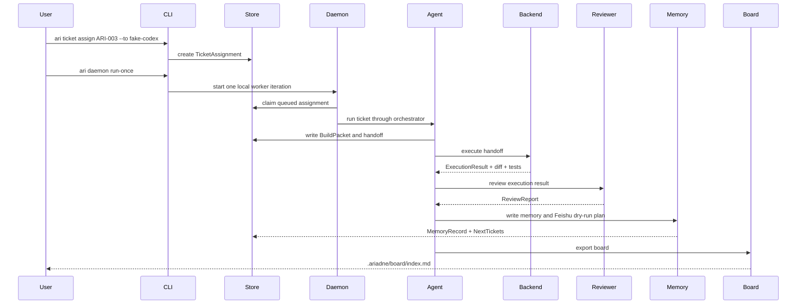
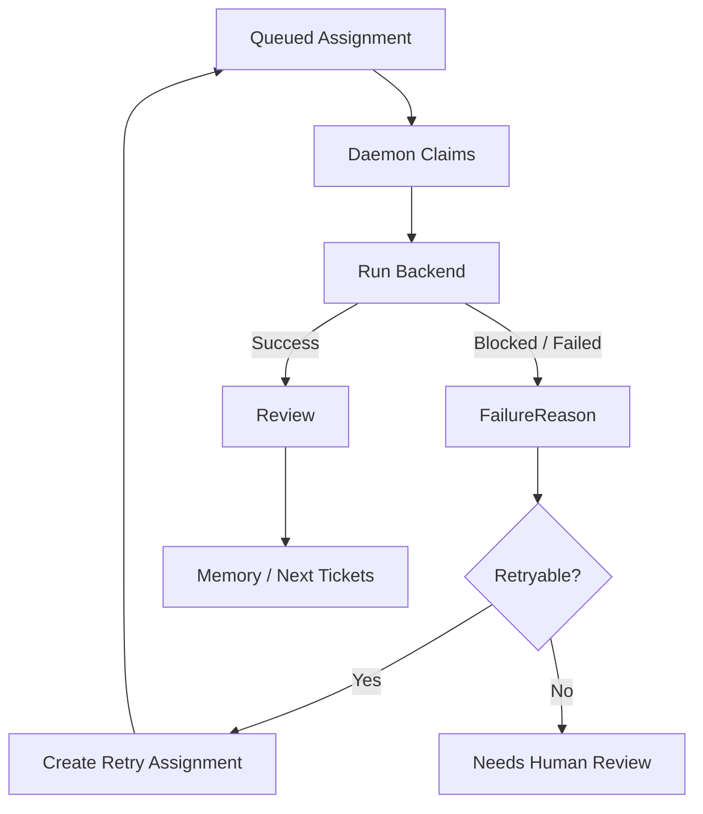

# Ariadne v1.0 Runtime Flow

This document freezes the Ariadne v1.0 runtime paths. It distinguishes the
future goal-first path from the currently implemented source-ingestion bridge.

## Future Goal-First Path

Target command shape:

```bash
ari goal create "把 Ariadne 做成对标 Multica 的多 Agent 构建团队"
ari goal attach-source GOAL-001 examples/real_inputs/ariadne_review_to_build.md
ari goal plan GOAL-001
ari ticket list
ari ticket assign ARI-003 --to fake-codex
ari daemon run-once
ari ticket comments ARI-003
ari export board
```

`BuildGoal` is a v1.0 architecture-freeze object. If the current implementation
does not yet expose `ari goal ...`, the supported bridge is source ingestion.
That bridge should not change the product direction:

```text
Build Goal -> Sources / Knowledge / Repo Context -> Tickets -> Agent Team
```

## Current v1.0 Implemented Path

The current stable local path is:

```bash
ari ingest examples/sources/*.md
ari ticket list
ari ticket assign ARI-003 --to fake-codex
ari daemon run-once
ari ticket comments ARI-003
ari runtime journal
ari export board
```

Fallback:

```bash
python3.11 -m ariadne_ltb.cli ingest examples/sources/*.md
python3.11 -m ariadne_ltb.cli ticket list
python3.11 -m ariadne_ltb.cli ticket assign ARI-003 --to fake-codex
python3.11 -m ariadne_ltb.cli daemon run-once
python3.11 -m ariadne_ltb.cli ticket comments ARI-003
python3.11 -m ariadne_ltb.cli runtime journal
python3.11 -m ariadne_ltb.cli export board
```

This path proves:

```text
Source
  -> Build Ticket
  -> Build Packet
  -> Assignment
  -> Daemon Worker
  -> Planner / Handoff
  -> Backend Execution
  -> Reviewer
  -> Memory / Feishu Dry Run / Next Tickets
  -> Board
```

## Real Codex Path

The real Codex path is optional and safety-gated:

```bash
ari ticket assign ARI-003 --to codex
ARIADNE_ENABLE_EXTERNAL_EXECUTION=1 ari daemon run-once --confirm-execution
```

Required boundaries:

- real Codex execution is off by default;
- both `ARIADNE_ENABLE_EXTERNAL_EXECUTION=1` and `--confirm-execution` are
  required;
- Codex unavailable or gate missing must produce a blocked result;
- Ariadne must not silently fall back to fake-codex;
- Ariadne must not auto-commit, auto-push, auto-merge, or create PRs.

## Runtime Sequence



## Failure And Recovery Flow



## Visibility Surfaces

Runtime work must be visible through:

- `ari ticket comments <ticket>`;
- `ari runtime journal`;
- `ari runtime recover`;
- `ari daemon status`;
- `.ariadne/artifacts/<ticket_id>/`;
- `.ariadne/memory/`;
- `.ariadne/feishu_plans/`;
- `.ariadne/board/index.md`.
